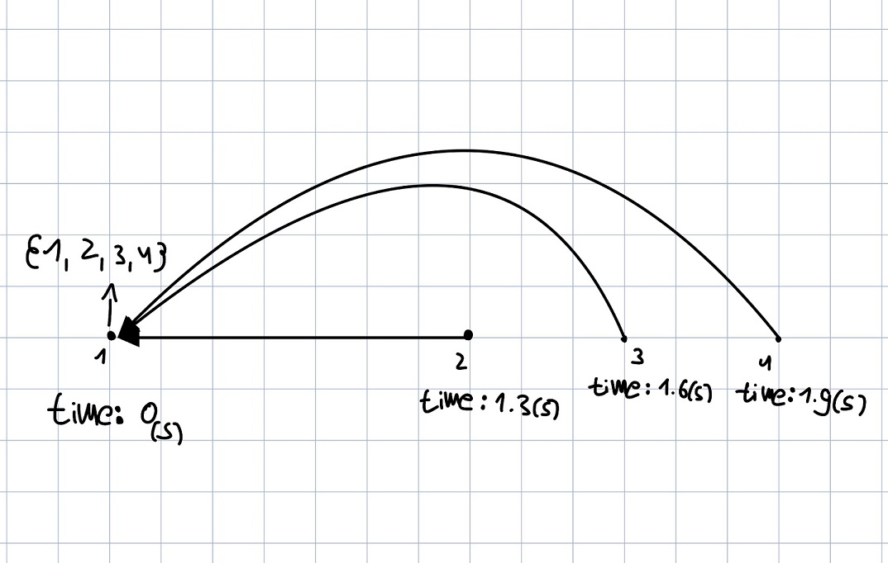

# password_rythem

A new, safer, more enjoyable way to register and login to websites or apps

## explanation

When we sign up to a website or a certain application, we will often use passwords made up of characters, boring, isn't it? what about puting some rhythm into our passwords and also strengthen them along the way?

now seriously. Today there are many effective tools for cracking passwords by brute force. The number of characters on our keyboard is finite. Therefore we want to make it more difficult for These tools to cruck our password. When we add the dimension of time to our passwords we open up a new and infinite space of possibilities for passwords. It all depends on the accuracy of the input system.

Lets say the accuracy of the system is .3 seconds and we need to choos a password contains 4 characters. and also we have {1, 2, 3, 4} to choos from.

With the usual way there are 4^4 = 256 options to choose a password from.

If we add rhythm: 

first char: 4 options

For the first character, the typing time has no meaning, therefore the number of options is the same as the number of characters we can use.

second character and onwards: infinite!

we can type each character whenever we want.

The first note will be time zero and all the other notes will have their time determined by how much time has passed since the tapping of the first note.

## images

## advantages

- more secure
- can be fun

## drawbacks
- can be hard for sum people to use
- The password is more difficult to remember and write
